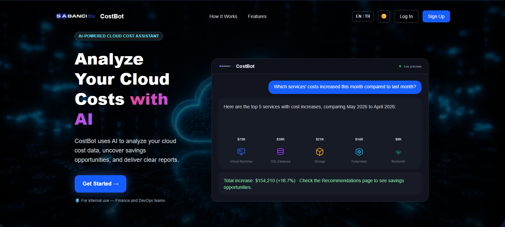
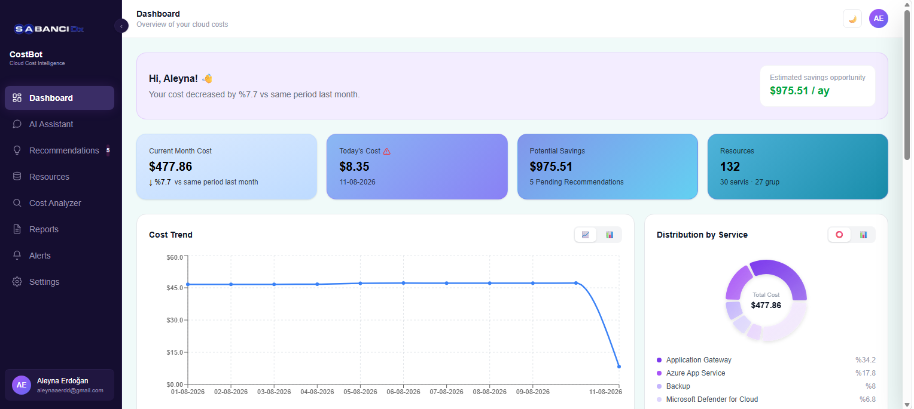
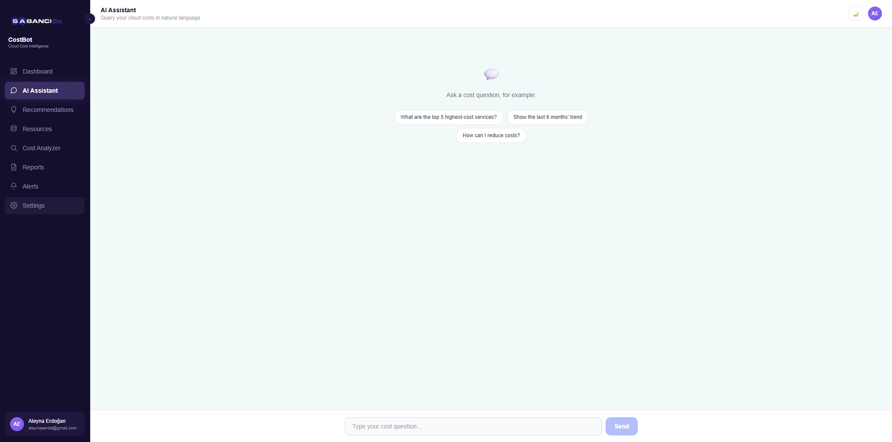
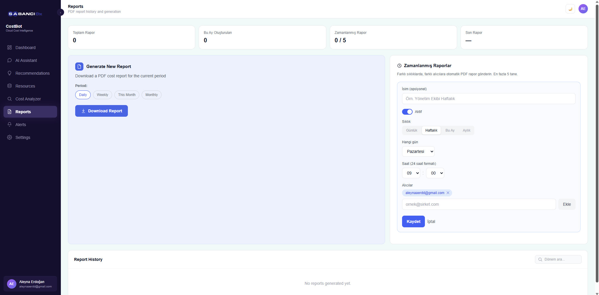
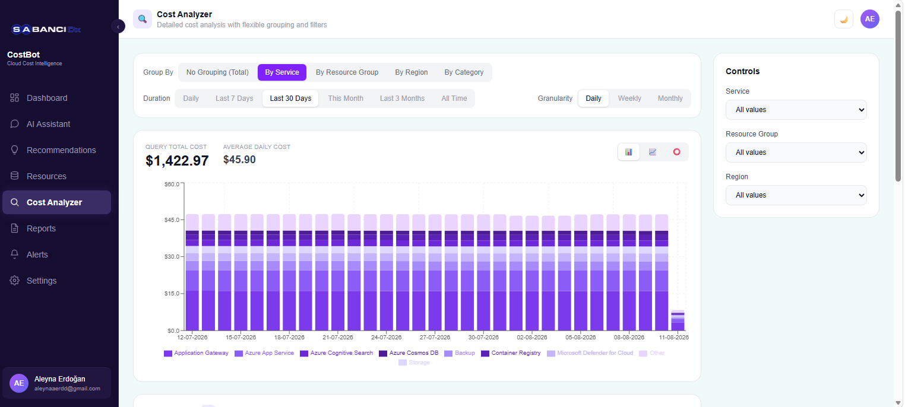

<div align="center">


# CostBot

### 💬 Doğal Dille Konuşan, Yapay Zeka Destekli Azure Bulut Maliyet Analiz Asistanı

<p>
  
  
  
  
  
  
  
  
</p>

<p>
  
  
  
</p>

*"Bu ay en pahalı servisim hangisi?" diye sormak, düzinelerce Azure Portal ekranında dolaşmaktan çok daha kolay.*

</div>

<br/>

> **📌 Not:** Bu proje, staj süresince SabancıDx'in Azure kaynakları üzerinde canlıya alınmıştı. Staj sonunda kurumsal kaynaklar kapatıldığı için canlı demo artık erişilebilir değil — aşağıdaki ekran görüntüleri, uygulamanın gerçek Azure ortamındaki çalışır hâlini yansıtmaktadır. Proje `docker-compose up` ile yerel ortamda eksiksiz çalıştırılabilir.

<br/>

---

<div align="center">

### 📑 İçindekiler

[Ne Yapıyor](#-bu-proje-ne-yapıyor) • [Rakamlar](#-proje-rakamları) • [Görseller](#-ekran-görüntüleri) • [Özellikler](#-öne-çıkan-özellikler) • [Mimari](#️-mimari) • [Teknolojiler](#️-teknoloji-yığını) • [Zorluklar](#-karşılaşılan-zorluklar--çözümler) • [Kurulum](#️-yerel-kurulum)

</div>

---

<br/>

## 💡 Bu Proje Ne Yapıyor?

Kurumların Azure bulut harcamalarını incelemesi genelde onlarca dashboard ekranında dolaşmayı, filtre üstüne filtre uygulamayı gerektirir. **CostBot**, bu süreci tek bir soruya indiriyor: *"Bu ay en pahalı servisim hangisi?"*

Gerçek Azure Cost Management verisiyle çalışan bu uygulama, kullanıcının doğal dilde sorduğu soruyu bir yapay zekâ ajanı aracılığıyla SQL sorgusuna çevirir, gerçek veritabanında çalıştırır ve **hiçbir sayı uydurmadan**, gerçek sonuçlara dayalı bir cevap üretir.

Bu projeyi, **SabancıDx bünyesinde tamamladığım yazılım mühendisliği stajı** kapsamında, fikir aşamasından canlı bir Azure ortamına taşınmasına kadar **uçtan uca tek başıma geliştirdim.**

<br/>

## 📊 Proje Rakamları

<div align="center">

|  📅  |  🗄️  |  ☁️  |  🌍  |  📆  |  🌐  |
|:---:|:---:|:---:|:---:|:---:|:---:|
| **30**<br/>İş Günü | **8**<br/>Veritabanı Tablosu | **132**<br/>İzlenen Kaynak | **11**<br/>Azure Bölgesi | **13+**<br/>Aylık Veri | **TR/EN**<br/>Dil Desteği |

</div>

<br/>

## 📸 Ekran Görüntüleri

<div align="center">

<p align="center"><b>🖥️ Web Arayüzü</b></p>


<br/><br/>

<p align="center"><b>📊 Dashboard</b></p>


<br/><br/>

<p align="center"><b>💬 AI Sohbet Arayüzü</b></p>


<br/><br/>

<p align="center"><b>📄 PDF Rapor</b></p>


<br/><br/>

<p align="center"><b>🔍 Cost Analyzer</b></p>


</div>

<br/>

## ✨ Öne Çıkan Özellikler

<table>
<tr>
<td width="50%" valign="top">

### 💬 Doğal Dil Sorgulama
Kullanıcı "Geçen aya göre en çok artan servis hangisi?" gibi bir soru yazdığında, LangChain tabanlı bir SQL ajanı bu soruyu gerçek zamanlı olarak SQL sorgusuna çevirir, veritabanında çalıştırır ve sonucu tekrar doğal dile dönüştürür. Yanıtlar **akan (streaming)** bir arayüzle gelir.

</td>
<td width="50%" valign="top">

### 📊 Canlı Dashboard
Toplam maliyet, aylık trend grafikleri, servis/kategori bazlı dağılım ve resource group karşılaştırmaları tek ekranda.

</td>
</tr>
<tr>
<td width="50%" valign="top">

### 🔮 AI Destekli Maliyet Tahmini
Geçmiş verilere ve istatistiksel trend analizine dayanarak ay sonu maliyeti tahmin edilir; sonuç, LLM tarafından doğal dilde yorumlanır.

</td>
<td width="50%" valign="top">

### 💡 Akıllı Tasarruf Önerileri
"Düşük kullanım + yüksek maliyet" sezgisiyle, gerçek veri üzerinde çalışan atıl kaynak tespiti yapılır.

</td>
</tr>
<tr>
<td width="50%" valign="top">

### 🎯 FinOps Sağlık Puanı
5 kural tabanlı kritere göre hesaplanan, 0-100 arası **deterministik** bir skor.

</td>
<td width="50%" valign="top">

### 🔔 Otomatik Uyarı Sistemi
Maliyet artışları ve bütçe eşiği aşımları otomatik olarak e-posta ve Microsoft Teams üzerinden bildirilir.

</td>
</tr>
<tr>
<td width="50%" valign="top">

### 📄 Zamanlanmış PDF Raporlama
Günlük/haftalık/aylık periyotlarda, çok dilli (TR/EN) PDF raporları otomatik e-posta ile gönderilir.

</td>
<td width="50%" valign="top">

### 🔐 Güvenli Kimlik Doğrulama
E-posta doğrulamalı kayıt, şifre sıfırlama akışı ve rol tabanlı erişim yapısı.

</td>
</tr>
</table>

<br/>

## 🏗️ Mimari

```
┌─────────────────┐      ┌──────────────────┐      ┌─────────────────┐
│    Next.js 15    │─────▶│     FastAPI       │─────▶│   PostgreSQL     │
│    TypeScript     │◀─────│     Python         │◀─────│                  │
│    (Frontend)      │      │    (Backend)        │      │  (Veritabanı)    │
└─────────────────┘      └────────┬─────────┘      └─────────────────┘
                                    │
                        ┌──────────┴──────────┐
                        ▼                     ▼
              ┌──────────────────┐  ┌─────────────────────┐
              │   Bulutistan LLM   │  │   Azure Cost         │
              │   (SQL Agent)       │  │   Management API       │
              └──────────────────┘  └─────────────────────┘
```

> Kullanıcının sorusu LLM tarafından **SQL'e çevrilir** → güvenlik doğrulamasından geçer (yalnızca `SELECT`) → PostgreSQL'de çalıştırılır → gerçek sonuç, ikinci bir LLM çağrısıyla doğal dile dönüştürülür.

<br/>

## 🛠️ Teknoloji Yığını

<div align="center">

| Katman | Teknolojiler |
|---|---|
| **Backend** | Python · FastAPI · PostgreSQL · LangChain · Azure Identity SDK · ReportLab · Matplotlib · APScheduler · Pytest |
| **Frontend** | Next.js 15 · TypeScript · Tailwind CSS · Recharts |
| **Altyapı & DevOps** | Docker · Azure App Service · Azure Database for PostgreSQL · Azure Container Registry |
| **Entegrasyonlar** | Azure Cost Management API · SMTP · Microsoft Teams Workflows |

</div>

<br/>

## 🐛 Karşılaşılan Zorluklar & Çözümler

| 🚩 Sorun | ✅ Çözüm |
|---|---|
| Zamanlanmış raporlar bazen **iki kez** gönderiliyordu | Arka plan görevine `threading.Lock()` eklenerek eşzamanlı çalışmanın önüne geçildi |
| LLM'in ürettiği SQL sorgularında **halüsinasyon** riski | LLM'e yalnızca SQL üretim yetkisi verildi; sorgu çalıştırılmadan önce `SELECT`-only doğrulama katmanından geçiriliyor |
| Container yeniden başlatıldığında zamanlama kontrolü **saat farkından** etkileniyordu | Tüm zaman hesaplamaları `Europe/Istanbul` saat dilimine sabitlendi |
| Geçmiş raporlar tekrar indirildiğinde **güncel veriyle yeniden üretiliyordu** | PDF içeriği artık veritabanında saklanıyor, geçmiş bir rapor o günkü **orijinal hâliyle** indiriliyor |

<br/>

## 🚀 Geliştirme Süreci

Bu proje kapsamında yalnızca kod yazmakla kalmadım; aynı zamanda:

- ☁️ Gerçek bir bulut API'sinden (Azure Cost Management) canlı veri çekme entegrasyonu kurdum
- 🤖 LangChain ile bir SQL ajanı geliştirip halüsinasyon riskini SQL doğrulama katmanıyla azalttım
- 🐳 Uygulamayı Docker ile container'laştırıp Azure App Service üzerinde canlıya aldım
- 🔒 HTTPS zorunluluğu, CORS kısıtlaması ve veritabanı erişim kontrolü gibi güvenlik önlemlerini uyguladım
- 📐 Uçtan uca sistem mimarisini bir UML sıralama (sequence) diyagramıyla belgeleyip ekibe sundum

<br/>

## ⚙️ Yerel Kurulum

<details>
<summary><b>🐍 Backend</b></summary>
<br/>

```bash
cd backend
python -m venv venv
venv\Scripts\Activate.ps1   # Windows
pip install -r requirements.txt
cp .env.example .env         # kendi bilgilerinizi girin
uvicorn app.main:app --reload --port 8000
```
</details>

<details>
<summary><b>⚛️ Frontend</b></summary>
<br/>

```bash
cd frontend
npm install
npm run dev
```
</details>

<br/>

Ya da tüm sistemi Docker ile tek komutla ayağa kaldırabilirsiniz:

```bash
docker-compose up -d --build
```

Uygulama `http://localhost:3000` adresinde çalışmaya başlar.

<br/>

## 🧪 Testler

```bash
cd backend
pytest test/ -v
```

<br/>

---

<div align="center">

## 📬 İletişim

**Aleyna Erdoğan**

[](https://www.linkedin.com/in/aleyna-erdogan)
[](mailto:aleynaaerdd@gmail.com)

<sub>Bu proje, SabancıDx bünyesinde tamamlanan bir staj kapsamında geliştirilmiştir.</sub>

</div>
